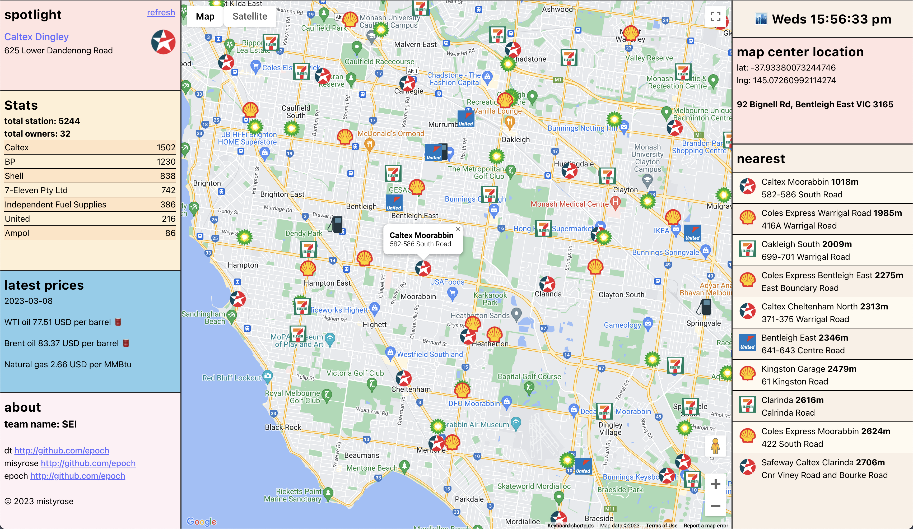

# Welcome!
Welcome to the Servo App project! Here, we present the collaborative work of Nikki, David, and Casey on creating an application using the Google Maps API to find service stations. Our goal was to develop a straightforward and efficient solution for locating nearby service stations. Through our combined efforts and innovative problem-solving, we've crafted the Servo App that meets this objective while prioritizing user-friendly features. Explore our project to learn more about how we've integrated technology to simplify the process of finding service stations.

## Getting Started
1. Replace the `.env.sample` file to `.env`,
2. Add the Google Maps API key into the .env file,
3. Run `npm i`,
4. Run `npm init -y`,
5. Run `npm i express pg ejs fs dotenv`,
6. Create a PSQL database named `servos`,
7. Add the postgres database URL link into the .env file,
8. Add the `servo_info` table from the db/schema.sql file into the PSQL servos database,
9. Run `node db/seed_data.js`,
10. Run `node server.js`.

## Screenshots of application

## Wireframe - Supplied with the initial task

## Features to Add
- Improve the implementation of markers: only add station markers when they're visible and remove markers when they're out of bounds to improve performance. If markers are already showing in the map, scrolling the map slightly should not redraw existing markers.
- Better CSS styling in the application: adding colours, fonts, borders, shadows, gradients, hover effects and hand crafted CSS.

## Technologies Used
- HTML
- CSS
- JavaScript
- SQL

## JavaScript Libraries Used
- express : the basic framework that the application runs upon
- pg : to access the server database
- ejs : to use JavaScript within the index page
- fs : to access the content within a text file
- dotenv : used for storing secrets
- nodemon : used during deveopment
